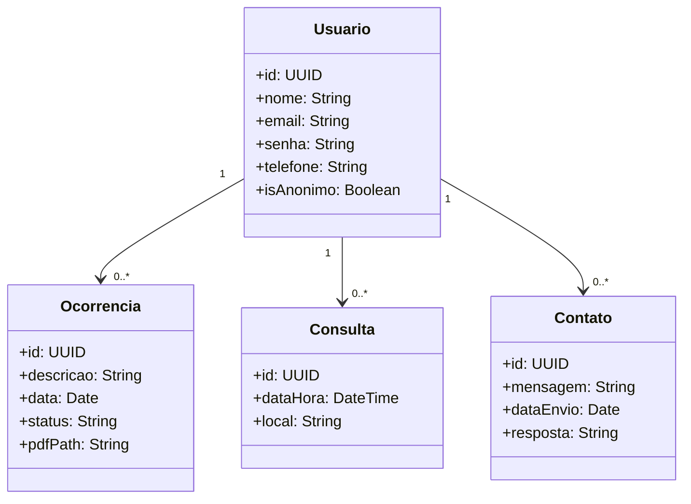
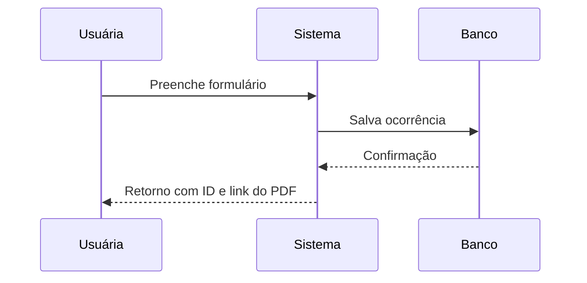

# Delegacia da Mulher 👩‍⚖️

Sistema web para registrar e acompanhar ocorrências relacionadas à violência contra a mulher, com funcionalidades de suporte, histórico e atendimento.

---

## Índice

1. Visão geral  
2. Tecnologias utilizadas  
3. Funcionalidades  
4. Diagramas (Mermaid)  
   - Diagrama de Classes  
   - Diagrama de Casos de Uso  
   - Diagrama de Fluxo / sequência simplificada  
5. Instalação e Execução  
6. Considerações futuras / Melhorias
7. Autores 

---

## 1. Visão geral

O sistema permite que mulheres (ou cidadãos) registrem ocorrências (de modo anônimo ou identificadas), agendem consultas, peçam apoio, visualizem o histórico, façam download da ocorrência em PDF e entrem em contato com a delegacia para ajuda. A ideia é criar uma ponte digital segura entre vítimas e atendimento especializado.

---

## 2. Tecnologias utilizadas

- **Frontend**: TypeScript, React / framework (ou biblioteca que você usou)  
- **Estilização**: Tailwind CSS (ou CSS puro, conforme repositório)
- **Bibliotecas auxiliares**: geração de PDF, autenticação JWT, roteamento, etc.

---

## 3. Funcionalidades principais 

- 📄 Registro de ocorrência (anônima ou não)
- 📅 Agendamento de consulta com profissionais da delegacia
- 🧠 Acesso a informações e materiais de apoio ao público feminino
- 🕓 Histórico completo das ocorrências já registradas
- 📥 Geração e download de PDF da ocorrência
- 📞 Canal direto de contato com a delegacia (mensagem ou suporte)

---

## 4. Diagramas (Mermaid)

### 4.1 Diagrama de Classes (simplificado)



### 4.2 Diagrama de Casos de Uso

```mermaid
actor "Vítima" as Vitima
actor "Delegacia" as Delegacia

Vitima --> (Registrar Ocorrência)
Vitima --> (Agendar Consulta)
Vitima --> (Visualizar Histórico)
Vitima --> (Baixar PDF da Ocorrência)
Vitima --> (Solicitar Apoio)

Delegacia --> (Responder Contato)
Delegacia --> (Analisar Ocorrências)
Delegacia --> (Gerenciar Consultas)
```

### 4.3 Diagrama de Fluxo (Simplificado)



### 5. Instalação e Execução

# Clone o repositório
git clone https://github.com/liviamanfre/delegaciadamulher.git
cd delegaciadamulher

# Instalar dependências
npm install

# Executar em modo de desenvolvimento
npm run dev

# Build para produção
npm run build


### 6. Considerações futuras / Melhorias

🔐 Autenticação mais robusta (autenticação multifatorial)

📲 Sistema de notificações (e-mail, SMS)

💬 Chat em tempo real para suporte emergencial

Geolocalização de ocorrências 

### 7. Autores 

Projeto desenvolvido por Lívia Manfré, Luiza Félix e Maria Clara 