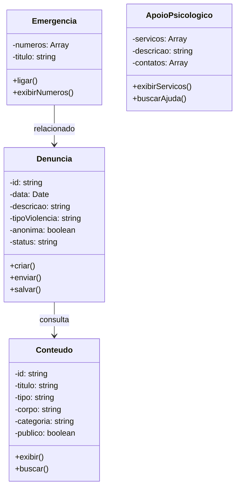
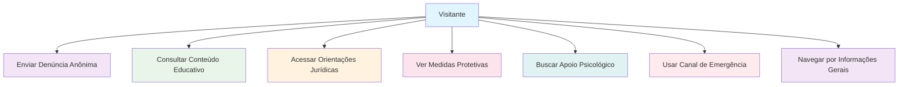
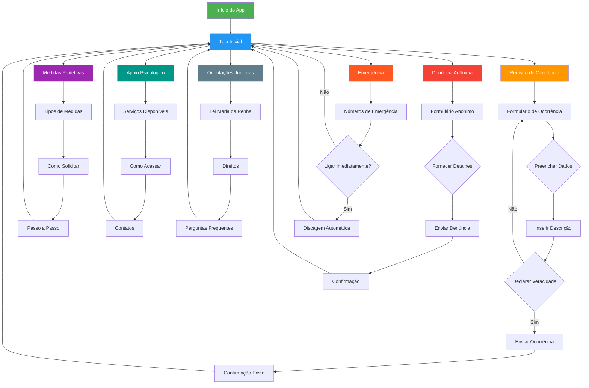
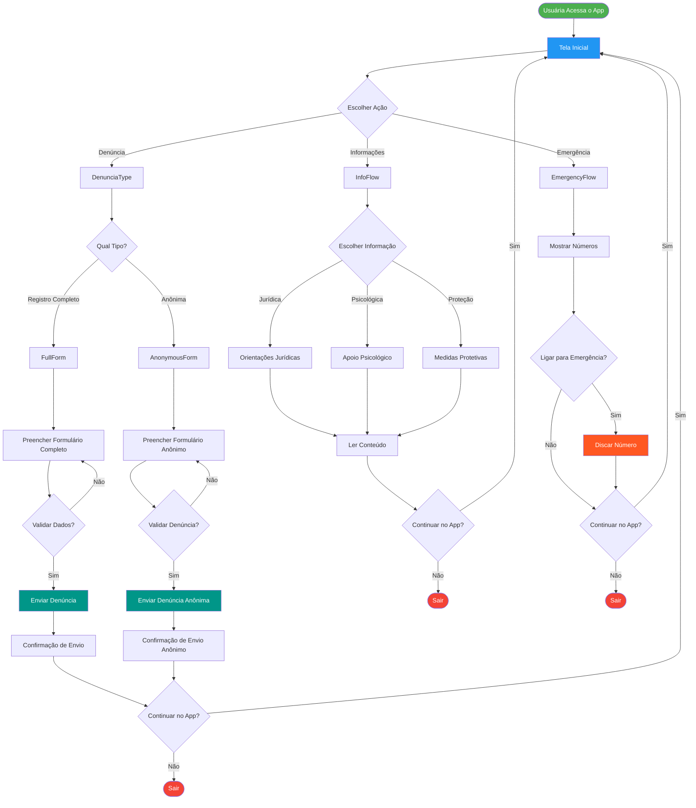
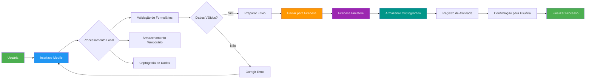
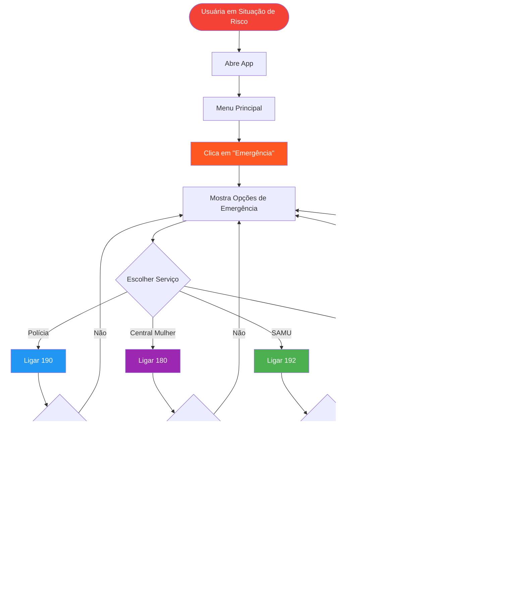
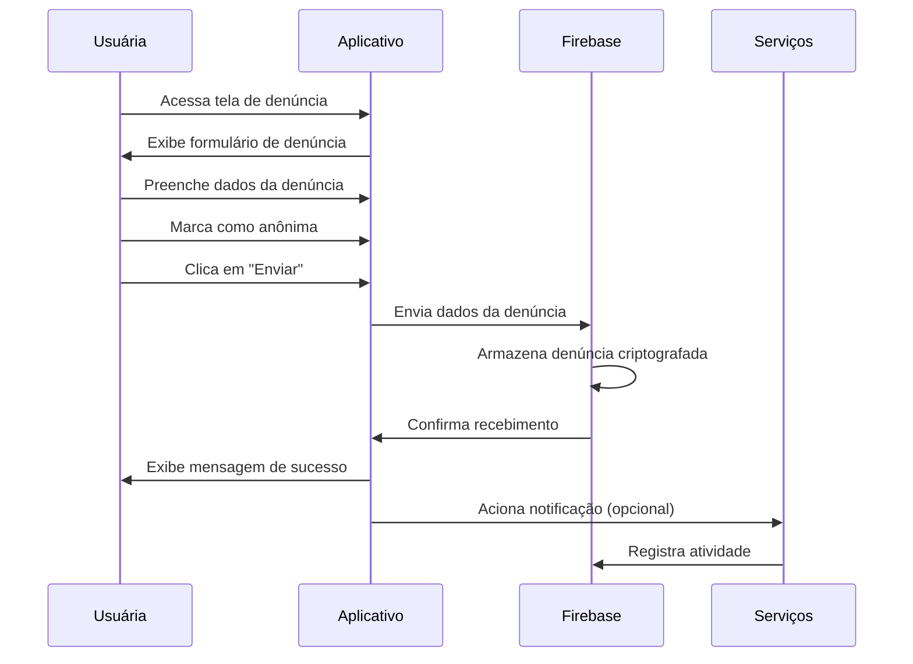
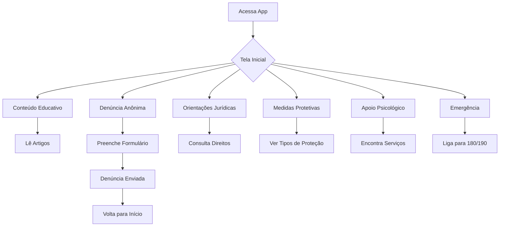
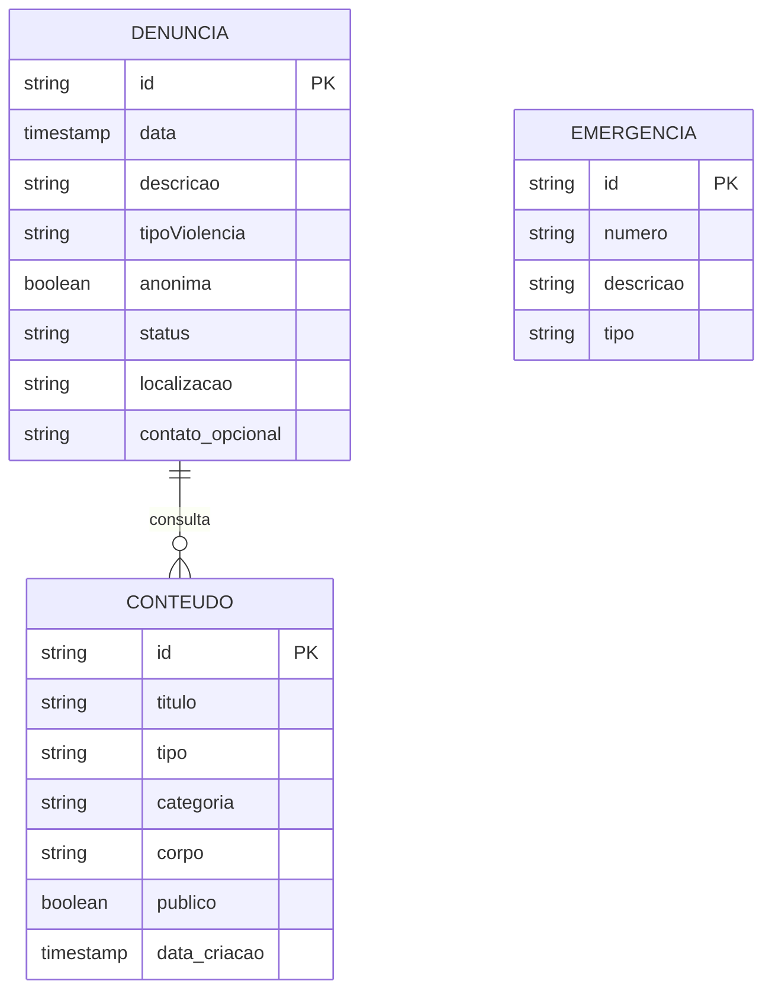

# Delegacia da Mulher 👩‍⚖️

Sistema web para registrar e acompanhar ocorrências relacionadas à violência contra a mulher, com funcionalidades de suporte, histórico e atendimento.

---

## Índice

1. Visão geral  
2. Tecnologias utilizadas  
3. Funcionalidades  
4. Diagramas (Mermaid)  
   - Diagrama de Classes  
   - Diagrama de Casos de Uso  
   - Diagrama de Fluxo 
   - Diagrama de Sequência - Registro de Denúncia
   - Diagrama de Atividades - Fluxo Principal 
   - Modelo de Dados - Entidade Denúncia 
5. Instalação e Execução  
6. Considerações futuras / Melhorias
7. Autores 

---

## 1. Visão geral

O sistema permite que mulheres (ou cidadãos) registrem ocorrências (de modo anônimo ou identificadas), agendem consultas, peçam apoio, visualizem o histórico, façam download da ocorrência em PDF e entrem em contato com a delegacia para ajuda. A ideia é criar uma ponte digital segura entre vítimas e atendimento especializado.

---

## 2. Tecnologias utilizadas

- **Frontend**: TypeScript, React  
- **Estilização**: Tailwind CSS 
- **Bibliotecas auxiliares**: geração de PDF, autenticação JWT, roteamento, etc.

---

## 3. Funcionalidades principais 

- 📄 Registro de ocorrência (anônima ou não)
- 📅 Agendamento de consulta com profissionais da delegacia
- 🧠 Acesso a informações e materiais de apoio ao público feminino
- 🕓 Histórico completo das ocorrências já registradas
- 📥 Geração e download de PDF da ocorrência
- 📞 Canal direto de contato com a delegacia (mensagem ou suporte)

---

## 4. Diagramas (Mermaid)

### 4.1 Diagrama de Classes 

```mermaid
classDiagram
    class Denuncia {
        -id: string
        -data: Date
        -descricao: string
        -tipoViolencia: string
        -anonima: boolean
        -status: string
        +criar()
        +enviar()
        +salvar()
    }
    
    class Conteudo {
        -id: string
        -titulo: string
        -tipo: string
        -corpo: string
        -categoria: string
        -publico: boolean
        +exibir()
        +buscar()
    }
    
    class Emergencia {
        -numeros: Array
        -titulo: string
        +ligar()
        +exibirNumeros()
    }
    
    class ApoioPsicologico {
        -servicos: Array
        -descricao: string
        -contatos: Array
        +exibirServicos()
        +buscarAjuda()
    }
    
    Denuncia --> Conteudo : consulta
    Emergencia --> Denuncia : relacionado
```

### 4.2 Diagrama de Casos de Uso

```mermaid
graph TD
    A[Visitante] --> B[Enviar Denúncia Anônima]
    A --> C[Consultar Conteúdo Educativo]
    A --> D[Acessar Orientações Jurídicas]
    A --> E[Ver Medidas Protetivas]
    A --> F[Buscar Apoio Psicológico]
    A --> G[Usar Canal de Emergência]
    A --> H[Navegar por Informações Gerais]
    
    style A fill:#e1f5fe
    style B fill:#f3e5f5
    style C fill:#e8f5e8
    style D fill:#fff3e0
    style E fill:#fce4ec
    style F fill:#e0f2f1
    style G fill:#ffebee
    style H fill:#f3e5f5
```

### 4.3 Diagrama de Fluxo - Navegação do Aplicativo

```mermaid
  flowchart TD
    A[Início do App] --> B[Tela Inicial]
    
    B --> C[Registro de Ocorrência]
    B --> D[Medidas Protetivas]
    B --> E[Apoio Psicológico]
    B --> F[Orientações Jurídicas]
    B --> G[Denúncia Anônima]
    B --> H[Emergência]
    
    %% Fluxo do Registro de Ocorrência
    C --> C1[Formulário de Ocorrência]
    C1 --> C2{Preencher Dados}
    C2 --> C3[Inserir Descrição]
    C3 --> C4{Declarar Veracidade}
    C4 -->|Sim| C5[Enviar Ocorrência]
    C4 -->|Não| C1
    C5 --> C6[Confirmação Envio]
    C6 --> B
    
    %% Fluxo das Medidas Protetivas
    D --> D1[Tipos de Medidas]
    D1 --> D2[Como Solicitar]
    D2 --> D3[Passo a Passo]
    D3 --> B
    
    %% Fluxo do Apoio Psicológico
    E --> E1[Serviços Disponíveis]
    E1 --> E2[Como Acessar]
    E2 --> E3[Contatos]
    E3 --> B
    
    %% Fluxo das Orientações Jurídicas
    F --> F1[Lei Maria da Penha]
    F1 --> F2[Direitos]
    F2 --> F3[Perguntas Frequentes]
    F3 --> B
    
    %% Fluxo da Denúncia Anônima
    G --> G1[Formulário Anônimo]
    G1 --> G2{Fornecer Detalhes}
    G2 --> G3[Enviar Denúncia]
    G3 --> G4[Confirmação]
    G4 --> B
    
    %% Fluxo de Emergência
    H --> H1[Números de Emergência]
    H1 --> H2{Ligar Imediatamente?}
    H2 -->|Sim| H3[Discagem Automática]
    H2 -->|Não| B
    H3 --> B
    
    style A fill:#4CAF50,color:white
    style B fill:#2196F3,color:white
    style C fill:#FF9800,color:white
    style D fill:#9C27B0,color:white
    style E fill:#009688,color:white
    style F fill:#607D8B,color:white
    style G fill:#F44336,color:white
    style H fill:#FF5722,color:white
``` 

### 4.4 Diagrama de Fluxo - Processo de Denúncia 

```mermaid
  flowchart TD
    Start([Usuária Acessa o App]) --> Home[Tela Inicial]
    
    Home --> Choose{Escolher Ação}
    
    Choose -->|Denúncia| DenunciaType
    Choose -->|Informações| InfoFlow
    Choose -->|Emergência| EmergencyFlow
    
    %% Fluxo de Denúncia
    DenunciaType --> Type{Qual Tipo?}
    Type -->|Registro Completo| FullForm
    Type -->|Anônima| AnonymousForm
    
    FullForm --> FillFull[Preencher Formulário Completo]
    AnonymousForm --> FillAnon[Preencher Formulário Anônimo]
    
    FillFull --> ValidateFull{Validar Dados?}
    FillAnon --> ValidateAnon{Validar Denúncia?}
    
    ValidateFull -->|Sim| SendFull[Enviar Denúncia]
    ValidateFull -->|Não| FillFull
    ValidateAnon -->|Sim| SendAnon[Enviar Denúncia Anônima]
    ValidateAnon -->|Não| FillAnon
    
    SendFull --> ConfirmFull[Confirmação de Envio]
    SendAnon --> ConfirmAnon[Confirmação de Envio Anônimo]
    
    ConfirmFull --> EndDenuncia
    ConfirmAnon --> EndDenuncia
    
    %% Fluxo de Informações
    InfoFlow --> InfoType{Escolher Informação}
    InfoType -->|Jurídica| Juridico[Orientações Jurídicas]
    InfoType -->|Psicológica| Psicologico[Apoio Psicológico]
    InfoType -->|Proteção| Protecao[Medidas Protetivas]
    
    Juridico --> ReadInfo[Ler Conteúdo]
    Psicologico --> ReadInfo
    Protecao --> ReadInfo
    ReadInfo --> EndInfo
    
    %% Fluxo de Emergência
    EmergencyFlow --> ShowNumbers[Mostrar Números]
    ShowNumbers --> EmergencyCall{Ligar para Emergência?}
    EmergencyCall -->|Sim| Call[Discar Número]
    EmergencyCall -->|Não| EndEmergency
    Call --> EndEmergency
    
    %% Finalização
    EndDenuncia{Continuar no App?}
    EndInfo{Continuar no App?}
    EndEmergency{Continuar no App?}
    
    EndDenuncia -->|Sim| Home
    EndDenuncia -->|Não| Exit1([Sair])
    EndInfo -->|Sim| Home
    EndInfo -->|Não| Exit2([Sair])
    EndEmergency -->|Sim| Home
    EndEmergency -->|Não| Exit3([Sair])
    
    style Start fill:#4CAF50,color:white
    style Home fill:#2196F3,color:white
    style Exit1 fill:#F44336,color:white
    style Exit2 fill:#F44336,color:white
    style Exit3 fill:#F44336,color:white
    style SendFull fill:#009688,color:white
    style SendAnon fill:#009688,color:white
    style Call fill:#FF5722,color:white
``` 

### 4.5 Diagrama de Fluxo - Processamento de Dados

```mermaid
 flowchart LR
    A[Usuária] --> B[Interface Mobile]
    
    B --> C{Processamento Local}
    
    C --> D[Validação de Formulários]
    C --> E[Armazenamento Temporário]
    C --> F[Criptografia de Dados]
    
    D --> G{Dados Válidos?}
    G -->|Sim| H[Preparar Envio]
    G -->|Não| I[Corrigir Erros]
    I --> B
    
    H --> J[Enviar para Firebase]
    
    J --> K[Firebase Firestore]
    K --> L[Armazenar Criptografado]
    
    L --> M[Registro de Atividade]
    M --> N[Confirmação para Usuária]
    
    N --> O[Finalizar Processo]
    
    style A fill:#4CAF50,color:white
    style B fill:#2196F3,color:white
    style J fill:#FF9800,color:white
    style K fill:#9C27B0,color:white
    style L fill:#009688,color:white
    style O fill:#4CAF50,color:white
``` 

### 4.6 Diagrama de Fluxo - Canal de Emergência 

```mermaid
  flowchart TD
    Start([Usuária em Situação de Risco]) --> App[Abre App]
    
    App --> MainMenu[Menu Principal]
    MainMenu --> EmergencyBtn[Clica em &quot;Emergência&quot;]
    
    EmergencyBtn --> ShowOptions[Mostra Opções de Emergência]
    
    ShowOptions --> ChooseEmergency{Escolher Serviço}
    
    ChooseEmergency -->|Polícia| Police[Ligar 190]
    ChooseEmergency -->|Central Mulher| Women180[Ligar 180]
    ChooseEmergency -->|SAMU| Samu192[Ligar 192]
    ChooseEmergency -->|Bombeiros| Fire193[Ligar 193]
    
    Police --> ConfirmCall1{Confirmar Chamada?}
    Women180 --> ConfirmCall2{Confirmar Chamada?}
    Samu192 --> ConfirmCall3{Confirmar Chamada?}
    Fire193 --> ConfirmCall4{Confirmar Chamada?}
    
    ConfirmCall1 -->|Sim| Dial190[Discal 190 Automaticamente]
    ConfirmCall1 -->|Não| ShowOptions
    ConfirmCall2 -->|Sim| Dial180[Discal 180 Automaticamente]
    ConfirmCall2 -->|Não| ShowOptions
    ConfirmCall3 -->|Sim| Dial192[Discal 192 Automaticamente]
    ConfirmCall3 -->|Não| ShowOptions
    ConfirmCall4 -->|Sim| Dial193[Discal 193 Automaticamente]
    ConfirmCall4 -->|Não| ShowOptions
    
    Dial190 --> End[Chamada Conectada]
    Dial180 --> End
    Dial192 --> End
    Dial193 --> End
    
    style Start fill:#F44336,color:white
    style EmergencyBtn fill:#FF5722,color:white
    style Police fill:#2196F3,color:white
    style Women180 fill:#9C27B0,color:white
    style Samu192 fill:#4CAF50,color:white
    style Fire193 fill:#FF9800,color:white
    style Dial190 fill:#2196F3,color:white
    style Dial180 fill:#9C27B0,color:white
    style Dial192 fill:#4CAF50,color:white
    style Dial193 fill:#FF9800,color:white
``` 

### 4.7 Diagrama de Sequência - Registro de Denúncia 

```mermaid
  sequenceDiagram
    participant U as Usuária
    participant A as Aplicativo
    participant F as Firebase
    participant S as Serviços
    
    U->>A: Acessa tela de denúncia
    A->>U: Exibe formulário de denúncia
    U->>A: Preenche dados da denúncia
    U->>A: Marca como anônima
    U->>A: Clica em "Enviar"
    
    A->>F: Envia dados da denúncia
    F->>F: Armazena denúncia criptografada
    F->>A: Confirma recebimento
    
    A->>U: Exibe mensagem de sucesso
    A->>S: Aciona notificação (opcional)
    S->>F: Registra atividade
``` 

### 4.8 Diagrama de Atividades - Fluxo Principal 

```mermaid
  flowchart TD
    A[Acessa App] --> B{Tela Inicial}
    B --> C[Conteúdo Educativo]
    B --> D[Denúncia Anônima]
    B --> E[Orientações Jurídicas]
    B --> F[Medidas Protetivas]
    B --> G[Apoio Psicológico]
    B --> H[Emergência]
    
    C --> I[Lê Artigos]
    D --> J[Preenche Formulário]
    E --> K[Consulta Direitos]
    F --> L[Ver Tipos de Proteção]
    G --> M[Encontra Serviços]
    H --> N[Liga para 180/190]
    
    J --> O[Denúncia Enviada]
    O --> P[Volta para Início]
``` 

### 4.9 Modelo de dados - Entidade Denúncia 

```mermaid
  erDiagram
    DENUNCIA {
        string id PK
        timestamp data
        string descricao
        string tipoViolencia
        boolean anonima
        string status
        string localizacao
        string contato_opcional
    }
    
    CONTEUDO {
        string id PK
        string titulo
        string tipo
        string categoria
        string corpo
        boolean publico
        timestamp data_criacao
    }
    
    EMERGENCIA {
        string id PK
        string numero
        string descricao
        string tipo
    }
    
    DENUNCIA ||--o{ CONTEUDO : consulta
``` 

### 5. Instalação e Execução

# Clone o repositório
git clone https://github.com/liviamanfre/delegaciadamulher.git
cd delegaciadamulher

# Instalar dependências
npm install

# Executar em modo de desenvolvimento
npm run dev

# Build para produção
npm run build

### 6. Considerações futuras / Melhorias

🔐 Autenticação mais robusta (autenticação multifatorial)

📲 Sistema de notificações (e-mail, SMS)

💬 Chat em tempo real para suporte emergencial

Geolocalização de ocorrências 

### 7. Autores 

Projeto desenvolvido por Lívia Manfré, Luiza Félix e Maria Clara 